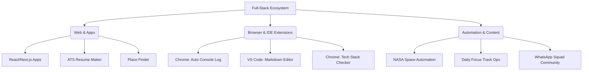

  

 

  

  I am a professional <strong>React Developer</strong> and <strong>Full-Stack Engineer</strong> with 3+ years of experience, currently working full-time at <strong>ThiDiff Technologies</strong> in Bengaluru. I specialize in building scalable tools, browser extensions, and automated content ecosystems.

<i>“Building at the intersection of development and automation.”</i>

 

### 💻 Tech Stack & Tools

  

 

  
  
  

---

### 🚀 Technical Ecosystem & Project Workflow
I develop high-utility tools for developers and creators.

---

### 🛠️ Professional Portfolio & Tools
- 💼 **Core Portfolio:** 🌐 [vallarasuk.com](https://vallarasuk.com) | ✍️ [dev.vallarasuk.com](https://dev.vallarasuk.com)
- 📚 **Developer Hubs:** 🌟 [Awesome Resources](https://vallarasuk.com/resources) | 💻 [GitHub Resources Portal](https://github.com/vallarasuk/awesome-developer-resources)
- 🧰 **Web Utilities:** 📄 [ATS Resume Maker](https://atsresumemaker.vallarasuk.com/) | ⌨️ [Typer](https://typer.vallarasuk.com/) | 📍 [Place Finder](https://placefinder.vallarasuk.com/) | 🔗 [urpage.in](https://urpage.in)
- 🎯 **Niche Platforms:** 🌌 [Space Gallery](https://space.vallarasuk.com/) | 📖 [Books Hub](https://books.vallarasuk.com/) | 📺 [Live TV](https://livetv.vallarasuk.com/)

---

### 🔌 Extensions & Marketplaces
**💻 VS Code Marketplace:** 
- 🛠️ [Auto Console Log](https://marketplace.visualstudio.com/items?itemName=VallarasuKanthasamy.auto-console-log-by-vallarasu-kanthasamy) | 📦 [View All Extensions](https://marketplace.visualstudio.com/publishers/VallarasuKanthasamy)

**🌐 Open VSX:** 
- 📝 [Markdown Editor](https://open-vsx.org/extension/VallarasuKanthasamy/universal-spreadsheet-markdown-editor) | 🛠️ [Auto Console Log](https://open-vsx.org/extension/VallarasuKanthasamy/auto-console-log-by-vallarasu-kanthasamy)

**🌍 Chrome Web Store:** 
- 🔍 [Tech Stack Checker](https://chromewebstore.google.com/detail/tech-stack-checker/lhcplmfhkmjobfnndaabeddibhimghgf?hl=en) | 🌗 [Opacity Adjuster](https://chromewebstore.google.com/detail/opacity-adjuster/elgajofcbjicopepiodbabodkajnihog?hl=en)

---

### 📺 Automation & Creator Brand
I manage automated content pipelines for space and professional growth.

- 🌌 **Space_Gallary:** 📸 [Instagram (NASA API Automation)](https://www.instagram.com/space_gallary/) | ▶️ [YouTube](https://youtube.com/@space_gallary)
- 🔥 **Daily_Focus_Track:** ▶️ [YouTube (65+ Subs | 120k+ Views | 3.3k+ Videos)](https://www.youtube.com/@Daily_focus_Track) | 🧵 [Threads](https://threads.net/@daily_focus_track) | 🐦 [X/Twitter](https://x.com/DailyFocusTrack) | 🤖 [Reddit](https://reddit.com/user/DailyFocusTrack) | 📸 [Instagram](https://instagram.com/daily_focus_track) | 📌 [Pinterest](https://pinterest.com/dailyfocustrack) | ✍️ [Medium](https://medium.com/@dailyfocustrack)

---

### 🏆 Creator Achievements

  
  

  
  

  

---

### 🤝🏻 Connect with Me

  
  
  
  
  
  
  
  
  
  
  
  

- 📧 **Direct:** [contact@vallarasuk.com](mailto:contact@vallarasuk.com)
- 👥 **Community:** [WhatsApp Squad](http://squad.vallarasuk.com/)

---

### 📊 GitHub Analytics

  
  

  

---

### 🐍 Contribution Snake Animation

  <picture>
    <source media="(prefers-color-scheme: dark)" srcset="https://raw.githubusercontent.com/vallarasuk/vallarasuk/output/github-contribution-grid-snake-dark.svg">
    <source media="(prefers-color-scheme: light)" srcset="https://raw.githubusercontent.com/vallarasuk/vallarasuk/output/github-contribution-grid-snake.svg">
    
  </picture>

